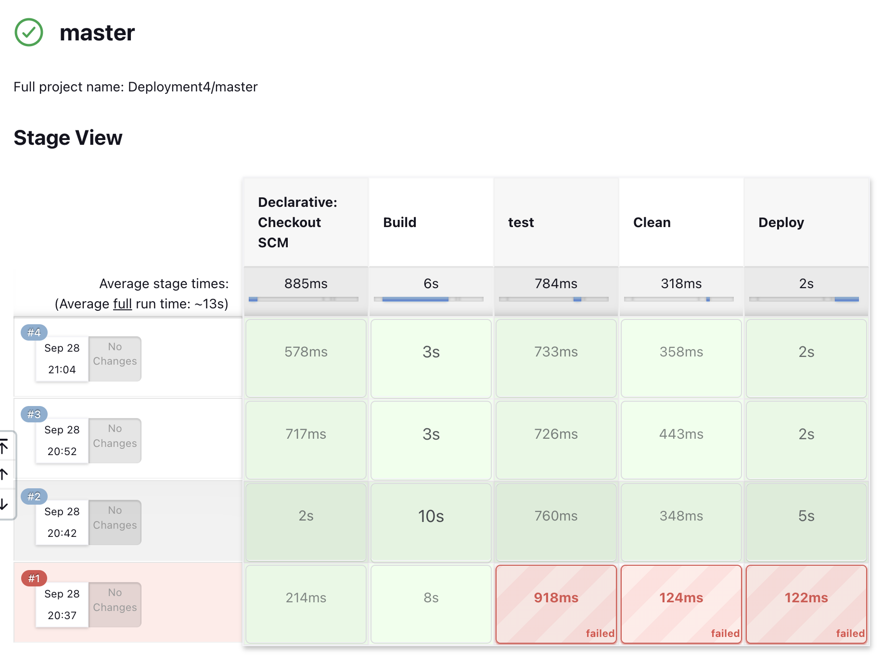
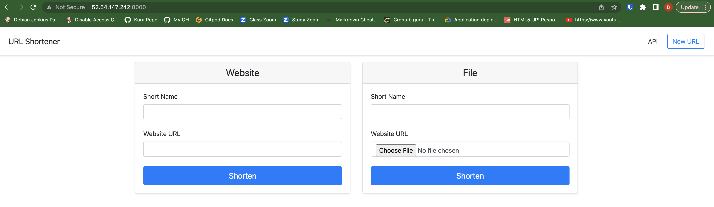
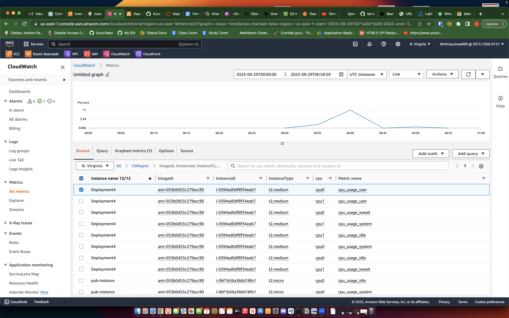
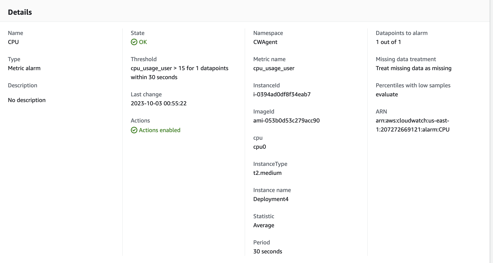
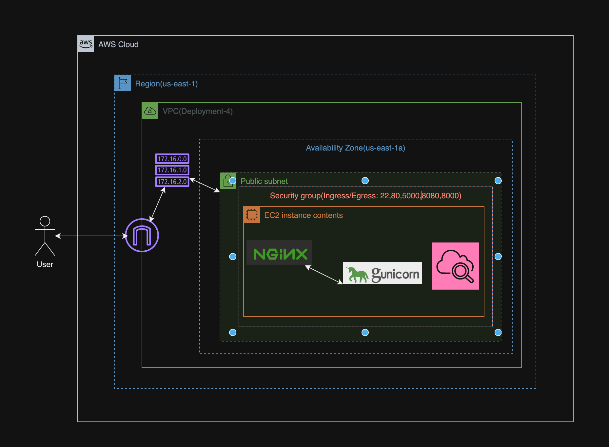

## Purpose
Deploy a web application onto an EC2 instance using Jenkins and setup monitoring of the application using AWS CloudWatch

## Steps
1. Create an EC2 ubuntu instance with Jenkins "python3.10-venv", "python3-pip" and "ngnix" installed onto it
2. Run the Jenkins Pipeline

3. Navigate to the web application to make sure it was deployed correctly

4. Install a cloudwatch agent onto the server using the [AWS Documentation](https://docs.aws.amazon.com/AmazonCloudWatch/latest/monitoring/install-CloudWatch-Agent-commandline-fleet.html)

5. Navigate to metrics section in Cloudwatch on the AWS Console and you should see metrics labeles "CWAgent"

6. Since I wanted to se how the server was performing I selected the "cpu_usage_user" metric.
 When I ran a second build the cpu spiked but not nearly as high as the first time. This could be because when we deployed the application nothing has changed and also the Gunicorn server has 4 worker process running in the background handling the requests that come in.

7. Add an alarm to notify you by email when the CPU goes above a certain percentage in a certain amount of time

## Systems Diagram

## Optimization
The instance seems to be able to handle subsequent deploys of the application without using most of it CPU so the t2.medium instance works fine and I didnt notice any significant latency when accessing the web application. Another option to increase availability of our web application would be to spin up a second nginx server in another availability zone and add an application load balancer.